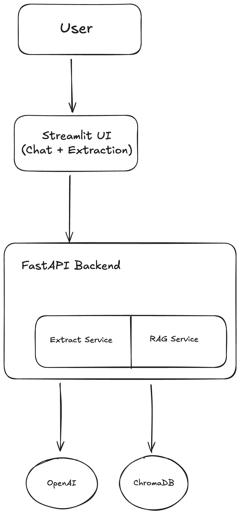

# Legal Contract Parser

AI-powered system for extracting structured information from legal contracts using LLMs and agentic workflows.

## Features
- 📄 PDF contract parsing with structure preservation
- 🤖 LLM-based clause extraction (15+ clause types)
- 🔗 Agentic workflows for handling cross-references and complex documents
- 🚀 REST API with FastAPI
- 🧪 Comprehensive test suite
- 📊 MLOps best practices (versioning, monitoring, CI/CD)

## Architecture


## Tech Stack
**Backend:**
- **Language**: Python 3.10+
- **Framework**: FastAPI
- **LLM**: OpenAI GPT-4 / Anthropic Claude
- **Orchestration**: LangChain, LangGraph
- **Package Manager**: Poetry
- **Testing**: Pytest
- **Type Safety**: Pydantic
- **Containerization**: Docker
  
**Frontend:**
- Streamlit (web UI)

**Deployment:**
- AWS EC2

## Dataset
Using **CUAD (Contract Understanding Atticus Dataset)** from https://www.atticusprojectai.org/cuad
- 510 commercial contracts with expert annotations
- 41 labeled clause types
- Real-world complexity (cross-references, exhibits, amendments)

## Quick Start

### Prerequisites
- Python 3.12 or higher
- Poetry ([installation guide](https://python-poetry.org/docs/#installation))
- OpenAI API key

### Installation
```bash
# Clone the repository
git clone <your-repo-url>
cd legal-contract-parser

# Install dependencies
poetry install

# Copy environment template
cp .env.example .env

# Add your OpenAI API key to .env
# OPENAI_API_KEY=sk-...

# Activate virtual environment
poetry shell
```

### Usage
```bash
# Run API server
poetry run uvicorn src.api.main:app --reload

# Run tests
poetry run pytest

# Format code
poetry run black src/ tests/

# Type checking
poetry run mypy src/
```

## Project Structure
```
legal-contract-parser/
├── src/
│   ├── parsers/      # PDF/HTML parsing logic
│   ├── extractors/   # LLM extraction logic
│   ├── agents/       # LangGraph agentic workflows
│   ├── api/          # FastAPI endpoints
│   └── utils/        # Helper functions
├── tests/            # Test suite
├── data/
│   ├── contracts/    # Sample contracts (not in repo)
│   └── outputs/      # Extraction results
├── config/
│   └── prompts/      # Versioned LLM prompts
├── pyproject.toml    # Poetry dependencies & config
└── README.md
```

## Development Roadmap

### Phase 1: Core Parser
- [x] Project setup
- [x] PDF parsing
- [x] LLM extraction (direct)
- [x] REST API
- [x] Testing framework

### Phase 2: Agentic Enhancement
- [ ] LangGraph integration
- [ ] Tool ecosystem (4 tools)
- [ ] Cross-reference resolution
- [ ] Validation & consistency checks

### Phase 3: MLOps & Production
- [ ] CI/CD pipeline
- [ ] Monitoring dashboard
- [ ] Docker deployment

## Status
**In Active Development** - Phase 1

## License
MIT

## Author
Angad Bashani - [LinkedIn](https://www.linkedin.com/in/angadbashani/)
